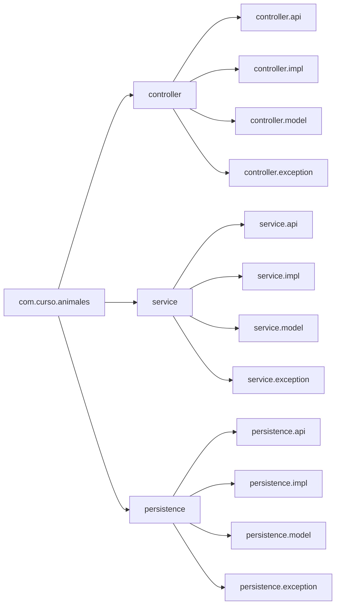
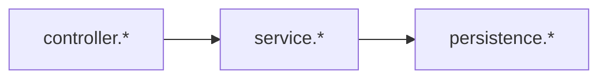

# Diagrama de paquetes

Base package: `com.curso.animales`

```mermaid
flowchart LR
    A[com.curso.animales]

    A --> C[controller]
    A --> S[service]
    A --> P[persistence]

    C --> CAPI[controller.api]
    C --> CIMP[controller.impl]
    C --> CMOD[controller.model]
    C --> CEX[controller.exception]

    S --> SAPI[service.api]
    S --> SIMP[service.impl]
    S --> SMOD[service.model]
    S --> SEX[service.exception]

    P --> PAPI[persistence.api]
    P --> PIMP[persistence.impl]
    P --> PMOD[persistence.model]
    P --> PEX[persistence.exception]
```

## Dependencias entre capas

```mermaid
flowchart LR
    C[controller.*] --> S[service.*]
    S --> P[persistence.*]
```
