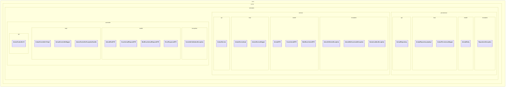
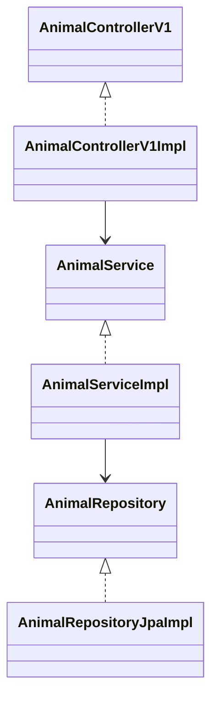

# Clases por paquete (sin detalle)

## Vista general

```mermaid
classDiagram 
    namespace com.curso.animales.controller.api {
        class AnimalControllerV1
    }

    namespace com.curso.animales.controller.impl {
        class AnimalControllerV1Impl
        class AnimalControllerMapper
        class AnimalControllerExceptionHandler
    }

    namespace com.curso.animales.controller.model {
        class AnimalRestDTO
        class CrearAnimalRequestDTO
        class ModificarAnimalRequestDTO
        class ErrorResponseDTO
    }

    namespace com.curso.animales.controller.exception {
        class ControllerValidationException
    }

    namespace com.curso.animales.service.api {
        class AnimalService
    }

    namespace com.curso.animales.service.impl {
        class AnimalServiceImpl
        class AnimalServiceMapper
    }

    namespace com.curso.animales.service.model {
        class AnimalDTO
        class CrearAnimalDTO
        class ModificarAnimalDTO
    }

    namespace com.curso.animales.service.exception {
        class AnimalYaExisteException
        class AnimalNoEncontradoException
        class DatosInvalidosException
    }

    namespace com.curso.animales.persistence.api {
        class AnimalRepository
    }

    namespace com.curso.animales.persistence.impl {
        class AnimalRepositoryJpaImpl
        class AnimalPersistenceMapper
    }

    namespace com.curso.animales.persistence.model {
        class AnimalEntity
    }

    namespace com.curso.animales.persistence.exception {
        class RepositorioException
    }
```

## Relaciones principales (alto nivel)

```mermaid
classDiagram
    class AnimalControllerV1
    class AnimalControllerV1Impl
    class AnimalService
    class AnimalServiceImpl
    class AnimalRepository
    class AnimalRepositoryJpaImpl

    AnimalControllerV1 <|.. AnimalControllerV1Impl
    AnimalService <|.. AnimalServiceImpl
    AnimalRepository <|.. AnimalRepositoryJpaImpl

    AnimalControllerV1Impl --> AnimalService
    AnimalServiceImpl --> AnimalRepository
```
