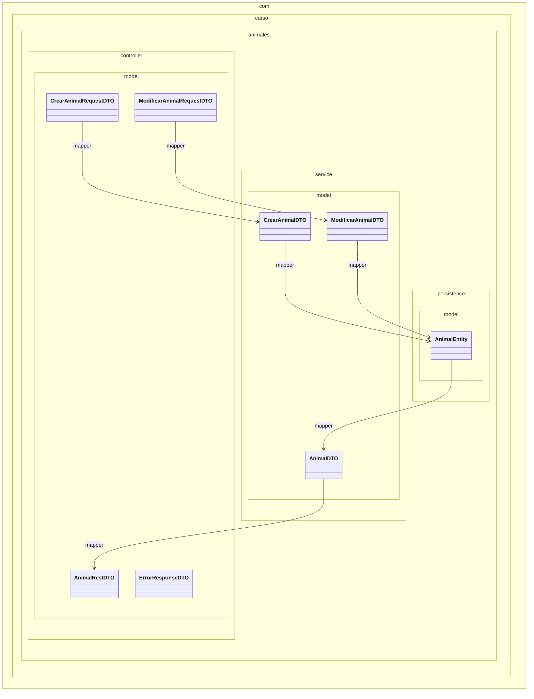
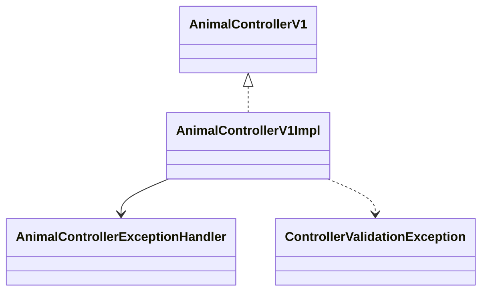
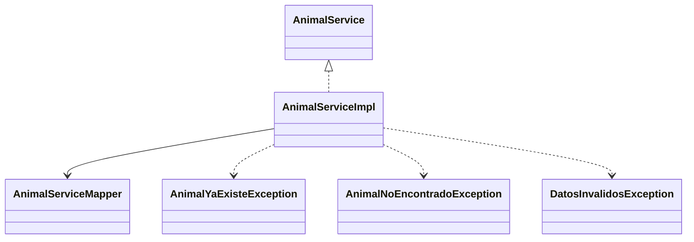
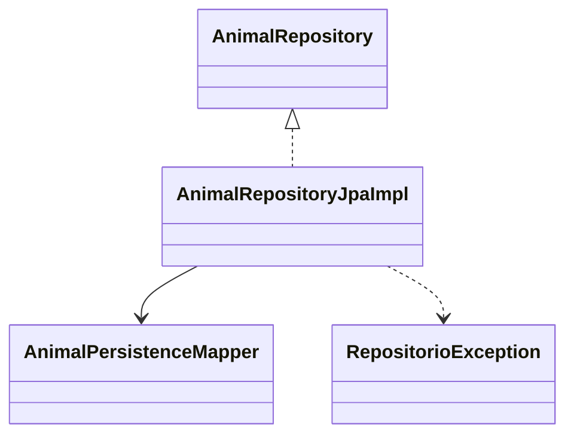
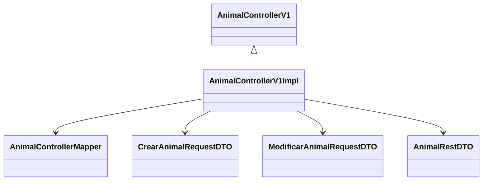
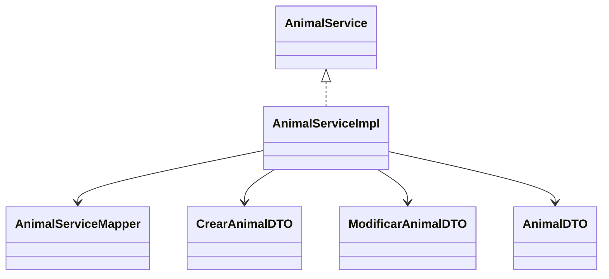
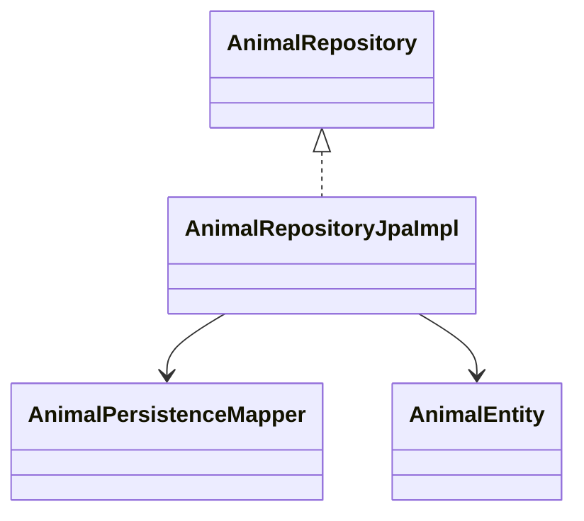

# Detalle de diagramas

## 1) Modelos separados (solo modelos)

## 2) Logica + excepciones (un grafico por paquete)

### controller

### service

### persistence

## 3) Logica + modelos (un grafico por paquete)

### controller

### service

### persistence

